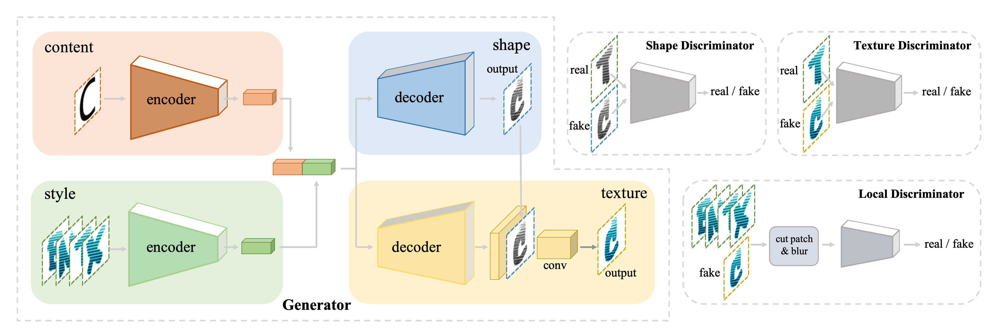
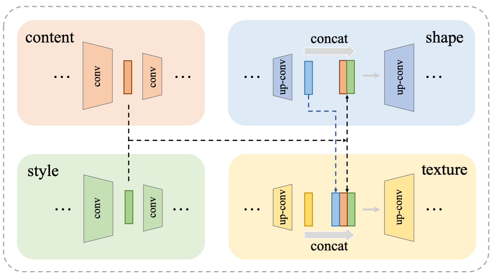
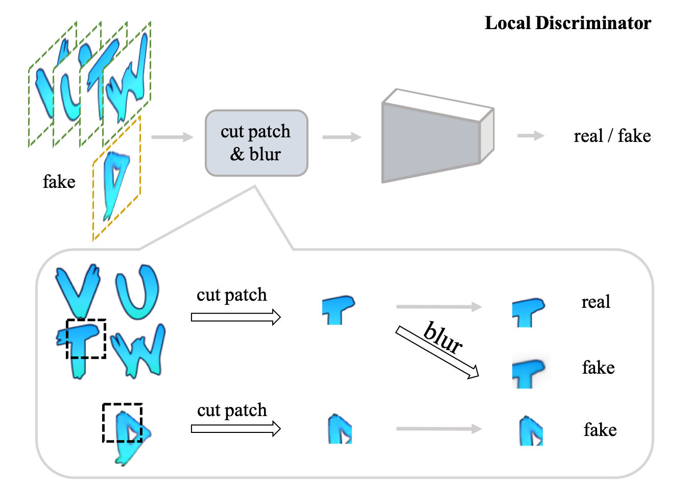
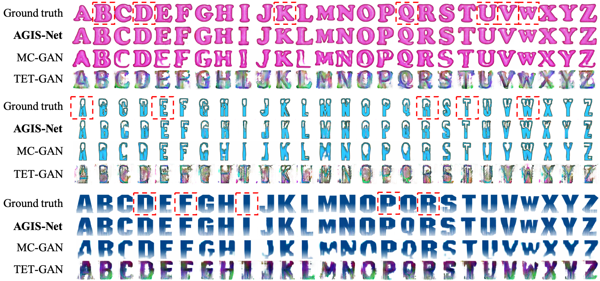
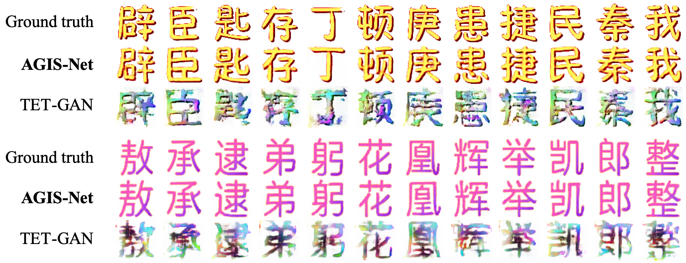

# AGIS-Net

## Introduction

This is the official PyTorch implementation of the Artistic Glyph Image Synthesis via One-Stage Few-Shot Learning. [paper](http://arxiv.org/abs/1910.04987)

## Abstract

Automatic generation of artistic glyph images is a challenging task that attracts many research interests. Previous methods either are specifically designed for shape synthesis or focus on texture transfer. In this paper, we propose a novel model, AGIS-Net, to transfer both shape and texture styles in one-stage with only a few stylized samples. To achieve this goal, we first disentangle the representations for content and style by using two encoders, ensuring the multi-content and multi-style generation. Then we utilize two collaboratively working decoders to generate the glyph shape image and its texture image simultaneously. In addition, we introduce a local texture refinement loss to further improve the quality of the synthesized textures. In this manner, our one-stage model is much more efficient and effective than other multi-stage stacked methods. We also propose a large-scale dataset with Chinese glyph images in various shape and texture styles, rendered from 35 professional-designed artistic fonts with 7,326 characters and 2,460 synthetic artistic fonts with 639 characters, to validate the effectiveness and extendability of our method. Extensive experiments on both English and Chinese artistic glyph image datasets demonstrate the superiority of our model in generating high-quality stylized glyph images against other state-of-the-art methods.

## Model Architecture



Skip Connection               |  Local Discriminator
:----------------------------:|:-------------------------:
  |  

## Demo






## Prerequisites

- Linux
- CPU or NVIDIA GPU + CUDA cuDNN
- Python 3
- PyTorch 0.4.0+

## Get Started

### Installation

1. Install PyTorch, torchvison and dependencies from [https://pytorch.org](https://pytorch.org)
2. Install python libraries [visdom](https://github.com/facebookresearch/visdom) and [dominate](https://github.com/Knio/dominate):
   ```shell
   pip install visdom
   pip install dominate
   ```
3. Clone this repo:
   ```shell
   git clone -b master --single-branch https://github.com/hologerry/AGIS-Net
   cd AGIS-Net
   ```
4. Download the offical pre-trained vgg19 model: [vgg19-dcbb9e9d.pth]('https://download.pytorch.org/models/vgg19-dcbb9e9d.pth'), and put it under the models/ folder

### Datasets
Download the datasets using the following script, four datasets and the raw average font style glyph image are available.
> It may take a while, please be patient
```
bash ./datasets/download_dataset.sh DATASET_NAME
```
- `base_gray_color` English synthesized gradient glyph image dataset, proposed by [MC-GAN](https://arxiv.org/abs/1712.00516).
- `base_gray_texture` English artistic glyph image dataset, proposed by [MC-GAN](https://arxiv.org/abs/1712.00516).
- `skeleton_gray_color` Chinese synthesized gradient glyph image dataset by us.
- `skeleton_gray_texture` Chinese artistic glyph image dataset proposed by us.

Please refer to the [data](data/) for more details about our datasets and how to prepare your own datasets.

### Model Training
- To train a model, download the training images (e.g., English artistic glyph transfer)
  ```shell
  bash ./datasets/download_dataset.sh base_gray_color
  bash ./datasets/download_dataset.sh base_gray_texture
  ```

- Train a model:

  1. Start the Visdom Visualizer
     ```shell
     python -m visdom.server -port PORT
     ```
     > PORT is specified in `train.sh`

  2. Pretrain on synthesized gradient glyph image dataset
     ```shell
     bash ./scripts/train.sh base_gray_color GPU_ID
     ```
     > GPU_ID indicates which GPU to use.

  3. Fineture on artistic glyph image dataset
     ```shell
     bash ./scripts/train.sh base_gray_texture GPU_ID DATA_ID FEW_SIZE
     ```
     > DATA_ID indicates which artistic font is fine-tuned.  
     > FEW_SIZE indicates the size of few-shot set.  
     
     It will raise an error saying:
     ```
     FileNodeFoundError: [Error 2] No such file or directory: 'chechpoints/base_gray_texture/base_gray_texture_DATA_ID_TIME/latest_net_G.pth
     ```
     Copy the pretrained model to above path
     ```shell
     cp chechpoints/base_gray_color/base_gray_color_TIME/latest_net_* chechpoints/base_gray_texture/base_gray_texture_DATA_ID_TIME/
     ```
     And start train again. It will works well.

### Model Testing
- To test a model, copy the trained model from `checkpoint` to `pretrained_models` folder (e.g., English artistic glyph transfer)
  ```shell
  cp chechpoints/base_gray_color/base_gray_texture_DATA_ID_TIME/latest_net_* pretrained_models/base_gray_texture_DATA_ID/
  ```

- Test a model
  ```shell
  bash ./scripts/test_base_gray_texture.sh GPU_ID DATA_ID
  ```

## Acknowledgements

This code is inspired by the [BicycleGAN](https://github.com/junyanz/BicycleGAN).

Special thanks to the following works for sharing their code and dataset.

- [pix2pix](https://github.com/junyanz/pytorch-CycleGAN-and-pix2pix)
- [MSGAN](https://github.com/HelenMao/MSGAN)
- [MC-GAN](https://github.com/azadis/MC-GAN)
- [TET-GAN](https://github.com/williamyang1991/TET-GAN)
- [EMD](https://github.com/zhyxun/Separating-Style-and-Content-for-Generalized-Style-Transfer)

## Citation

If you find our work is helpful, please cite our paper:
```
@article{Gao2019Artistic,
  author = {Yue, Gao and Yuan, Guo and Zhouhui, Lian and Yingmin, Tang and Jianguo, Xiao},
  title = {Artistic Glyph Image Synthesis via One-Stage Few-Shot Learning},
  journal = {ACM Trans. Graph.},
  issue_date = {November 2019},
  volume = {38},
  number = {6},
  year = {2019},
  articleno = {185},
  numpages = {12},
  url = {http://doi.acm.org/10.1145/3355089.3356574},
  publisher = {ACM}
} 
```

## Copyright

The code and dataset are only allowed for PERSONAL and ACADEMIC usage.
